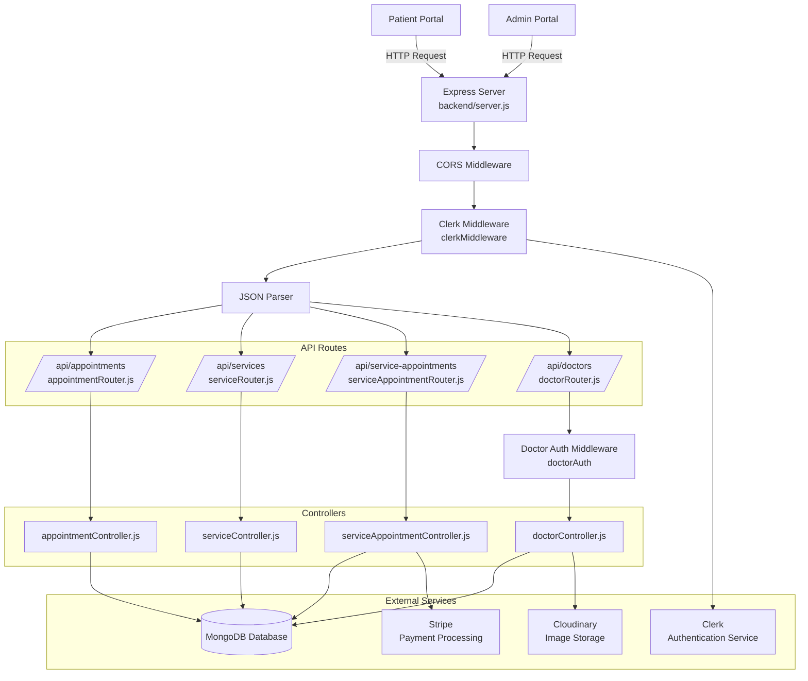

# Hospital Management App

CareSync is a full-stack hospital management platform with separate backend API, patient-facing frontend, and admin/doctor management portals. The platform is designed to streamline the complete healthcare workflow for patients, doctors, and administrators. The system provides a centralized solution for appointment scheduling, doctor management, medical service discovery, secure authentication, image management, and online payment processing.

---

## 🚀 Project Summary

This repository contains a healthcare appointment system built with:

- `backend/` — Express + MongoDB API server
- `frontend/` — patient-facing React/Vite website
- `admin/` — admin/doctor portal React/Vite application

The platform supports both doctor appointments and service appointments, including online payment, doctor profile management, and appointment tracking.

---

## 🧩 What’s Included

### Backend (`backend/`)

- REST API built with Express and Mongoose
- MongoDB data models for doctors, services, appointments, and service appointments
- Clerk authentication for patient-protected endpoints
- Doctor JWT authentication for admin features
- Image upload support via Cloudinary
- Stripe Checkout integration for online payments
- CORS whitelist configuration for production domains

### Patient Frontend (`frontend/`)

- Browse doctors and medical services
- View doctor/service details
- Book appointments and service appointments
- Verify payment success/cancel status
- Access patient appointments
- Tailwind-powered UI with modern React routing

### Admin Portal (`admin/`)

- Auth-protected admin dashboard via Clerk
- Add and manage doctors
- Add and manage services
- View appointment dashboards
- Manage service appointment records

---

## 📁 Repository Structure

```text
backend/            # Server API and backend logic
frontend/           # Patient-facing React app
admin/              # Admin/doctor portal React app
```

---

## 📁 Project Workflow



<!--  -->

---

## 🛠️ Tech Stack

- Node.js
- Express
- MongoDB / Mongoose
- React 19
- Vite
- Tailwind CSS
- Clerk Auth
- Stripe Checkout
- Cloudinary
- Multer

---

## ⚙️ Setup Guide

Each subproject installs and runs independently.

### Backend Setup

```bash
cd backend
npm install
```

Create `backend/.env` with:

```env
MONGODB_URI=                  YOUR_MONGODB_URI
JWT_SECRET=                   YOUR_JWT_SECRET
CLOUDINARY_CLOUD_NAME=        YOUR_CLOUDINARY_CLOUD_NAME
CLOUDINARY_API_KEY=           YOUR_CLOUDINARY_API_KEY
CLOUDINARY_API_SECRET=        YOUR_CLOUDINARY_API_SECRET
STRIPE_SECRET_KEY=            YOUR_STRIPE_SECRET_KEY
FRONTEND_URL=                 YOUR_FRONTEND_URL
CLERK_PUBLISHABLE_KEY=        YOUR_CLERK_PUBLISHABLE_KEY
CLERK_SECRET_KEY=             YOUR_CLERK_SECRET_KEY
```

Start the backend:

```bash
npm start
```

### Frontend Setup

```bash
cd frontend
npm install
```

Create `frontend/.env` with:

```env
VITE_CLERK_PUBLISHABLE_KEY=   YOUR_VITE_CLERK_PUBLISHABLE_KEY
```

Run the frontend:

```bash
npm run dev
```

### Admin Setup

```bash
cd admin
npm install
```

Create `admin/.env` with:

```env
VITE_CLERK_PUBLISHABLE_KEY=   YOUR_VITE_CLERK_PUBLISHABLE_KEY
```

Run the admin portal:

```bash
npm run dev
```

---

## 📦 Package Scripts

### Backend

- `npm start` — start Express server with `nodemon`

### Frontend / Admin

- `npm run dev` — start Vite development server
- `npm run build` — build production assets
- `npm run preview` — preview production build
- `npm run lint` — run ESLint

---

## 🧭 API Reference

### Health

- `GET /health` — returns server status and uptime

### Doctors

- `GET /api/doctors` — list doctors
- `POST /api/doctors/login` — doctor login
- `GET /api/doctors/:id` — get doctor by ID
- `POST /api/doctors` — create doctor (image upload supported)
- `PUT /api/doctors/:id` — update doctor (authenticated)
- `POST /api/doctors/:id/toggle-availability` — toggle availability
- `DELETE /api/doctors/:id` — delete doctor

### Services

- `GET /api/services` — list services
- `GET /api/services/:id` — get service by ID
- `POST /api/services` — create service (image upload supported)
- `PUT /api/services/:id` — update service
- `DELETE /api/services/:id` — delete service

### Appointments

- `GET /api/appointments` — list all appointments
- `GET /api/appointments/confirm` — confirm payment status
- `GET /api/appointments/stats/summary` — appointment summary stats
- `POST /api/appointments` — create appointment (Clerk auth required)
- `GET /api/appointments/me` — patient appointments for signed-in users
- `GET /api/appointments/doctor/:doctorId` — get doctor-specific appointments
- `POST /api/appointments/:id/cancel` — cancel appointment
- `GET /api/appointments/patients/count` — count registered patients
- `PUT /api/appointments/:id` — update appointment

### Service Appointments

- `GET /api/services-appointments` — list service appointments
- `GET /api/services-appointments/confirm` — confirm service payment
- `GET /api/services-appointments/stats/summary` — service appointment stats
- `POST /api/services-appointments` — create service appointment (Clerk auth required)
- `GET /api/services-appointments/me` — get service appointments for current user
- `GET /api/services-appointments/:id` — get service appointment by ID
- `PUT /api/services-appointments/:id` — update service appointment
- `POST /api/services-appointments/:id/cancel` — cancel service appointment

---

## 🔐 Environment Variables

### Backend

- `MONGODB_URI` — MongoDB connection URI
- `JWT_SECRET` — JWT secret for doctor auth
- `CLOUDINARY_CLOUD_NAME` — Cloudinary cloud name
- `CLOUDINARY_API_KEY` — Cloudinary API key
- `CLOUDINARY_API_SECRET` — Cloudinary API secret
- `STRIPE_SECRET_KEY` — Stripe secret key
- `FRONTEND_URL` — frontend URL used for payment redirect callbacks
- `CLERK_PUBLISHABLE_KEY` — Clerk publishable key
- `CLERK_SECRET_KEY` — Clerk secret key

### Frontend

- `VITE_CLERK_PUBLISHABLE_KEY` — Clerk publishable key for the patient app

### Admin

- `VITE_CLERK_PUBLISHABLE_KEY` — Clerk publishable key for the admin portal

---

## 💡 Deployment Notes

- The backend CORS policy is limited to approved origins in `backend/server.js`
- Stripe payment confirmation depends on valid `FRONTEND_URL`
- Cloudinary stores uploaded images; replacing or deleting records removes old images where possible
- Clerk secures the frontend and admin routes, while doctor admin routes use JWT auth

---

## ✅ Notes

- Dependencies are managed inside each subfolder (`backend`, `frontend`, `admin`)
- Do not commit real secrets or `.env` files to source control
- `backend` is the central API for both React clients

---
